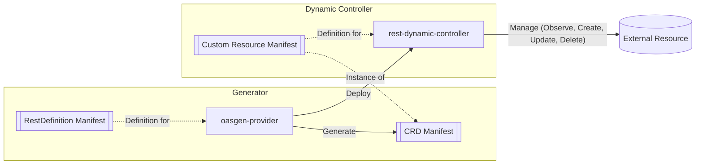
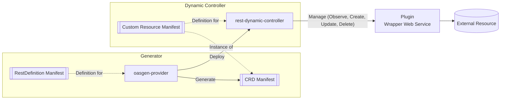

# Architecture

RDC is **dynamic**: the binary compiles in no resource types. At startup it receives a
single Group/Version/Resource (`-group`/`-version`/`-resource`, main.go) and builds a
generic controller (`unstructured-runtime`) over that GVR. oasgen-provider deploys one
such instance per `RestDefinition`, so "the controller for `Repo`" and "the controller
for `Workflow`" are the same image with different flags.

## Standard scenario

## Scenario with plugin (wrapper web service)

When the external API does not fit the expected interface, a wrapper web service can
front it. This is not a separate mode: the OAS document declares an operation-level
`servers` override, and the client re-targets that single operation at the override URL
(`internal/tools/client/restclient.go`, `op.Servers[0]`; multiple servers per operation
are not supported).

## The reconcile loop (internal/controllers/restResources.go)

Every reconcile starts by resolving the CR's `RestDefinition`
(`internal/tools/definitiongetter`): the definitions are listed cluster-wide
(`ogen.krateo.io/v1alpha1`, `restdefinitions`) and matched by kind + group. From it RDC
gets the OAS location (`spec.oasPath` — `http(s)://`, `configmap://<ns>/<name>/<key>`,
or a local file; `internal/tools/filegetter`), the verbs, and the resource contract
(identifiers, additionalStatusFields, compareScope). The CR's `spec.configurationRef`
points at a generated `<Kind>Configuration` CR (always `v1alpha1`) carrying per-instance
API configuration and authentication: **basic**, **bearer**, or **apiKey-in-header** —
credentials come from Secrets and are whitespace-trimmed (getter.go, `GetSecret`).

- **Observe** — `get` when the identifier is known, else `findby` (list + identifier
  match, `identifiersMatchPolicy` AND/OR, optional `continuationToken` pagination).
  `notFoundCodes` remap status codes to absence; a `notFoundBody` jq predicate detects
  body-signalled absence (tombstones). The response is normalized through the verb's
  response `fieldMapping`/`responseTransform`, projected into status (identifiers +
  additionalStatusFields), then compared for drift under `compareScope`: `fullSpec`
  (default), `identifiersAndStatus`, or `updatable` (only fields the update verb's
  request body can express — anything else would loop unfixably).
- **Create / Update** — the request is assembled from the CR via `fieldMapping`
  (path/query/body anchors, `secretRef` resolvers, `alias`/`jq` value mappings), then a
  whole-document `requestTransform` runs, then the call is made. Responses repopulate
  status from scratch (stale identifiers are cleared first).
- **Delete** — same pipeline; the finalizer is **held** on transient definition-lookup
  failures but **released** when the RestDefinition is genuinely gone or the resource
  was never addressable (unresolved path placeholders), to avoid wedging namespaces.

**Async (long-running) operations** are declared per verb: Model A (`blocking`,
default) polls the operation inline to completion; Model B (`requeue`) records the
operation handle on the CR, sets the `Pending` condition, and lets each Observe poll
once until terminal (`internal/controllers/async_requeue.go`).

**RESTAction delegation** — `observeApiRef`/`createApiRef`/`updateApiRef`/`deleteApiRef`
replace a verb with a snowplow-resolved `RESTAction` (`internal/tools/snowplow`),
invoked under the controller's own identity: the projected ServiceAccount token is
exchanged at authn for a JWT (`internal/tools/authn`). Delegated deletes are verified
gone before the finalizer is released.

**secretRef RBAC self-provisioning** (`internal/tools/secretrbac`) — when a CR's
`fieldMapping` resolves values from Secrets, RDC grants **itself** a per-CR-instance,
least-privilege Role (`<plural>-<version>-<hash>-secrets`, get/list/watch on exactly
those Secret names) bound to its own ServiceAccount, and tears it down on delete. This
is why the SA identity env vars are hard-required at startup.

Conditions (`Ready` with reasons Available/Creating/Deleting/Unavailable/Pending),
Kubernetes Events and OTel metrics/traces (gated off by default) complete the loop —
see [api](./api.md) and [configuration](./configuration.md).
